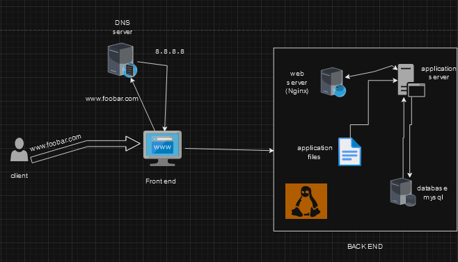

# One-Server Web Infrastructure with LAMP Stack

This README provides an overview of a simple web infrastructure designed for hosting a website accessible via www.foobar.com. The infrastructure comprises one server using a LAMP (Linux, Apache, MySQL, PHP/Python/Perl) stack. Below are the details and explanations.

## Infrastructure Components:

### 1. Server:
- A single machine (physical or virtual) responsible for hosting the entire web infrastructure.

### 2. Web Server (Nginx):
- Manages incoming HTTP requests.
- Acts as a reverse proxy, forwarding dynamic content requests to the application server.
- Serves static content efficiently.

### 3. Application Server:
- Executes dynamic elements of the web application.
- Processes user requests and generates dynamic content.
- Hosts the application files/codebase.

### 4. Application Files (Code Base):
- Contains the source code of the web application.
- Includes server-side scripts, HTML, CSS, and other necessary files.

### 5. Database (MySQL):
- Stores and retrieves data for the web application.
- Manages the backend data store.

### 6. Domain Name (foobar.com):
- A human-readable address pointing to the server's IP (8.8.8.8).
- Configured with a www record for www.foobar.com.

## Specifics about the Infrastructure:

- **What is a Server:**
  - A computing device responsible for processing requests, managing resources, and hosting the web infrastructure.

- **Role of the Domain Name:**
  - Provides a human-readable address (www.foobar.com) for accessing the website.
  
- **DNS Record (www):**
  - The "www" in www.foobar.com is a CNAME record, pointing to the main domain.

- **Role of the Web Server (Nginx):**
  - Handles HTTP requests, manages connections, and serves static content.

- **Role of the Application Server:**
  - Executes dynamic elements, processes user requests, and hosts the application codebase.

- **Role of the Database (MySQL):**
  - Stores and retrieves data for the web application.

- **Communication with User's Computer:**
  - The server communicates with the user's computer through the HTTP protocol, facilitated by the web server.

## Issues with the Infrastructure:

- **Single Point of Failure (SPOF):**
  - The entire infrastructure is dependent on a single server. If it fails, the website becomes inaccessible.

- **Downtime for Maintenance:**
  - Deploying new code may require restarting the web server, leading to temporary downtime.

- **Scalability Concerns:**
  - The infrastructure may struggle to handle high traffic. Scaling is limited by the capacity of a single server.

Note: This basic infrastructure is suitable for small-scale applications. For improved reliability and scalability, consider more advanced architectures involving redundancy, load balancing, and distributed systems.
