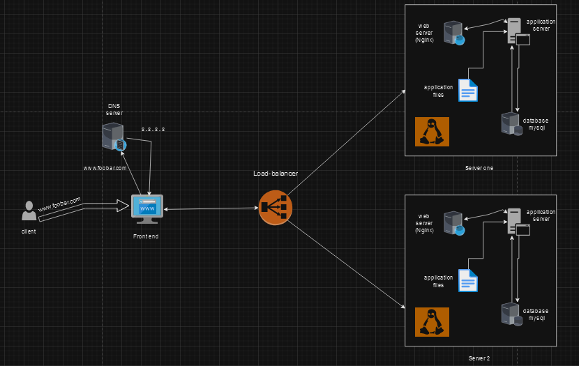

# Three-Server Web Infrastructure Design

## Components:

### 1. Load Balancer (HAproxy):
- **Reasoning:**
  - To distribute incoming traffic across multiple servers, enhancing performance and reliability.
- **Distribution Algorithm:**
  - Round Robin: Sends requests to each server in turn, distributing the load equally.
- **Active-Active Setup:**
  - All servers actively handle traffic, promoting load balancing and redundancy.

### 2. Web Server (Nginx):
- **Reasoning:**
  - Efficiently handles HTTP requests, serves static content, and acts as a reverse proxy.
  
### 3. Application Server:
- **Reasoning:**
  - Executes dynamic elements of the web application and processes user requests.
  
### 4. Database Server (MySQL):
- **Reasoning:**
  - Manages the storage and retrieval of data for the web application.

### 5. Second Application Server:
- **Reasoning:**
  - Adds redundancy and capacity to handle increased traffic or server failures.

### 6. Set of Application Files (Code Base):
- **Reasoning:**
  - Contains the source code of the web application, ensuring consistency across servers.

### 7. Second Server:
- **Reasoning:**
  - Provides an additional server for hosting components, improving fault tolerance.

## Specifics about the Infrastructure:

- **Load Balancer (HAproxy):**
  - **Distribution Algorithm (Round Robin):**
    - Ensures an equal distribution of requests among servers, preventing overload on a single server.
  - **Active-Active Setup:**
    - All servers actively share the traffic load, providing redundancy and fault tolerance.

- **Database Primary-Replica (Master-Slave) Cluster:**
  - **How it Works:**
    - The Primary node manages write operations (INSERT, UPDATE), and the Replica nodes replicate data from the Primary, handling read operations.
  - **Difference Between Primary and Replica:**
    - The Primary node is responsible for write operations, ensuring data consistency. Replica nodes handle read operations, distributing the load.

## Issues with the Infrastructure:

- **Single Points of Failure (SPOFs):**
  - The load balancer, if not redundant, can become a single point of failure.
  - Absence of redundancy in the database can lead to a single point of failure.

- **Security Issues:**
  - No firewall mentioned, potentially exposing servers to unauthorized access.
  - Lack of HTTPS leaves data transmissions unencrypted, posing a security risk.

- **No Monitoring:**
  - Absence of monitoring tools makes it challenging to identify and address performance issues or potential failures.
