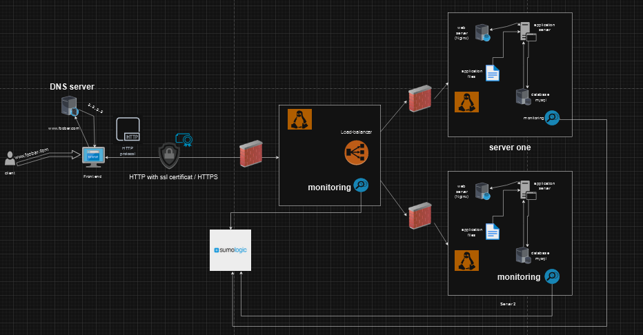

# Three-Server Secured Web Infrastructure Design

## Components:

### 1. Load Balancer (Nginx):
- **Reasoning:**
  - Efficiently distributes incoming traffic across servers, enhancing performance and reliability.
  - Terminates SSL at the load balancer to offload encryption processing from application servers.

### 2. Web Servers (Nginx):
- **Reasoning:**
  - Handles HTTP requests, serves static content, and acts as a reverse proxy.
  - Ensures redundancy for fault tolerance.

### 3. Application Servers:
- **Reasoning:**
  - Executes dynamic elements of the web application and processes user requests.

### 4. Database Servers (MySQL):
- **Reasoning:**
  - Manages the storage and retrieval of data for the web application.
  - Multiple servers for redundancy and load balancing.

### 5. Firewalls:
- **Reasoning:**
  - Adds an extra layer of security by controlling incoming and outgoing network traffic.
  - Protects the infrastructure from unauthorized access and potential attacks.

### 6. SSL Certificate:
- **Reasoning:**
  - Enables HTTPS to encrypt data in transit, ensuring secure communication between clients and servers.
  - Provides a trusted and secure environment for user interactions.

### 7. Monitoring Clients (Sumo Logic Data Collectors):
- **Reasoning:**
  - Monitors system health, performance, and logs in real-time.
  - Detects and alerts on potential issues, improving overall infrastructure reliability.

## Specifics about the Infrastructure:

- **Firewalls:**
  - **Purpose:**
    - Control and filter network traffic, preventing unauthorized access and enhancing security.

- **SSL Certificate (HTTPS):**
  - **Purpose:**
    - Encrypts data transmitted between clients and servers, ensuring confidentiality and integrity.
    - Establishes trust with users by providing a secure connection.

- **Monitoring:**
  - **Purpose:**
    - Identifies and addresses issues proactively, ensuring optimal performance and uptime.
    - Collects and analyzes data to provide insights into system behavior.

  - **Data Collection:**
    - Sumo Logic Data Collectors collect logs, metrics, and traces, providing a comprehensive view of the infrastructure.
  
  - **Monitoring Web Server QPS:**
    - Configure the monitoring tool to track and analyze the web server's Query Per Second (QPS).
    - Set up alerts for abnormal QPS patterns to identify potential issues.

## Issues with the Infrastructure:

- **Terminating SSL at the Load Balancer:**
  - **Issue:**
    - SSL termination at the load balancer exposes decrypted traffic within the internal network.
  - **Solution:**
    - Implement end-to-end encryption by securing communication from the load balancer to application servers.

- **Single MySQL Server Accepting Writes:**
  - **Issue:**
    - Single point of failure for write operations on the database.
  - **Solution:**
    - Implement a MySQL cluster with multiple nodes to distribute write operations and enhance fault tolerance.

- **Identical Components Across Servers:**
  - **Issue:**
    - Uniform components increase vulnerability; a single issue could impact all servers.
  - **Solution:**
    - Implement diversity in server components, reducing the risk of a system-wide failure due to a single point of vulnerability.
